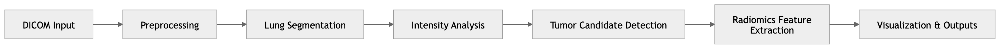
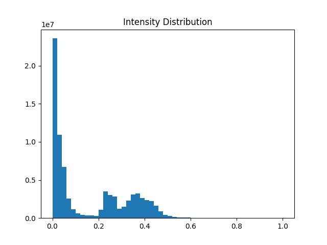

# PET/CT Image Analysis Pipeline for NSCLC Dataset

## Project Overview

This project implements an end-to-end **PET/CT image processing pipeline** in Python for large-scale analysis of the NSCLC Radiogenomics dataset.

The workflow focuses on **exploratory PET intensity-based analysis and lung region processing**, including:

- automated processing of DICOM data  
- robust lung segmentation under real-world conditions  
- detection of high-intensity regions in PET images  
- extraction of PET intensity-based quantitative metrics  
- visualization and exploratory imaging analysis  

⚠️ This project is an exploratory imaging analysis pipeline and does not perform clinical tumor segmentation or diagnosis.

## Pipeline Overview

The figure below summarizes the full computational workflow:

 

## Background

Lung cancer is one of the leading causes of cancer-related mortality worldwide, with **Non-Small Cell Lung Cancer (NSCLC)** accounting for approximately 85–90% of cases.

PET/CT imaging plays a key role in:
- anatomical and functional assessmentn  
- disease staging  
- treatment planning support  

Quantitative PET intensity patterns are commonly analyzed in:
- radiomics research  
- exploratory imaging studie  


## Methodology

### 1. Data Handling
- Recursive loading of DICOM files  
- Automatic  scan grouping
- Slice ordering and normalization  


### 2. Lung Segmentation  
Two-stage approach for robustness:

#### Deep Learning (lungmask)
- Pre-trained U-Net model  
- Slice-wise inference  

#### Fallback Method
- Rule-based threshold segmentation
- Automatically used when model inference fails


### 3. PET Intensity Analysis

Before region detection, PET intensity distributions are analyzed:  
- Minimum, maximum, and mean intensity values  
- Histogram-based visualization of voxel distributions  
- Scan-level variability assessment 

This enables:
- identification of high-intensity regions
- understanding inter-scan variability
- data-driven threshold selection  

Example output:
```
Min:          0.0
Max:     84629.29
Mean:        0.41
```

Example histogram:   


### 4. High-Intensity Region Detection  
- Adaptive thresholding based on PET intensity distribution  
- Threshold computed within lung regions (preferred approach)  
- Identification of candidate high-intensity regions  

The threshold is derived from:
- lung-only voxel distribution (primary)  
- global intensity distribution (fallback)  


Example:
```
Threshold:      0.39
```


### 5. Quantitative Feature Extraction

From detected regions, PET intensity-based features are extracted:  
- Region volume (voxel-based)
- Maximum intensity (PET intensity metric)
- Mean intensity (PET intensity metric)

These features support **exploratory radiomics-style analysis**, not clinical validation. 


### 6. Visualization

The pipeline generates:

- Multi-slice PET visualizations  
- Lung segmentation overlays  
- High-intensity region overlays  
- Intensity distribution histograms  

All outputs are automatically saved:
```
outputs/
├── figures/
└── tables/
```

## Results

Example output:
```
| Patient | Tumor_Volume_voxels | Max_Intensity | Mean_Intensity |
| ------- | ------------------- | ------------- | -------------- |
| R01-001 |      1,363,730      |      1.0      |    0.142992    |
```

### Observations

- Lung segmentation was robust due to fallback strategy
- High-intensity region detection is sensitive to threshold selection
- Significant variability exists across PET intensity distributions  
- Some scans may not contain detectable high-intensity regions under chosen thresholds


### Interpretation

These results highlight key real-world challenges in PET imaging:  
- variability in PET intensity distributions across scans
- absence of ground-truth annotations
- limitations of threshold-based exploratory detection

Additionally:  
- intensity distributions differ significantly between scans
- threshold-based methods may under- or over-estimate regions of interest

Zero-detection cases reflect:  
- conservative thresholding strategy
- dataset variability
- absence of strong high-intensity regions in some scans


## Visualization

Example segmentation output:
 
   


## Limitations  
- No ground-truth annotations available  
- Region detection is intensity-based (not supervised)  
- lungmask performance varies across scans  
- PET intensity not fully standardized to clinical SUV (dataset-dependent constraints)  
- Sensitivity to acquisition variability and noise

## Technical Stack

- Python  
- NumPy, Pandas  
- Matplotlib  
- PyDICOM  
- SimpleITK  
- lungmask (pre-trained U-Net)


## Project Structure
```
project/
├── notebook.ipynb
├── outputs/
│ ├── figures/
│ └── tables/
└── README.md
```


## Key Contributions  
- Built end-to-end PET/CT DICOM processing pipeline  
- Implemented robust lung segmentation with fallback mechanism  
- Developed adaptive intensity-based region detection  
- Designed automated quantitative and visual analysis workflow  
- Enabled reproducible exploratory analysis of large-scale imaging data


## Future Work  
- Integration of PyRadiomics for extended feature extraction  
- Improved segmentation methods for PET/CT specificity  
- Multi-modal PET/CT fusion analysis  
- Machine learning-based classification of intensity patterns


## Important Note  
This project performs **exploratory PET/CT intensity-based analysis**.

It does not:  
- perform clinical tumor segmentation  
- provide diagnostic outputs  
- validate lesions against ground truth  

Instead, it demonstrates:  
- robust medical image processing pipelines  
- intensity-based region analysis  
- scalable DICOM handling and automation 


## References  
- TCIA NSCLC Radiogenomics Dataset  
- PET/CT imaging literature  
- lungmask segmentation model
